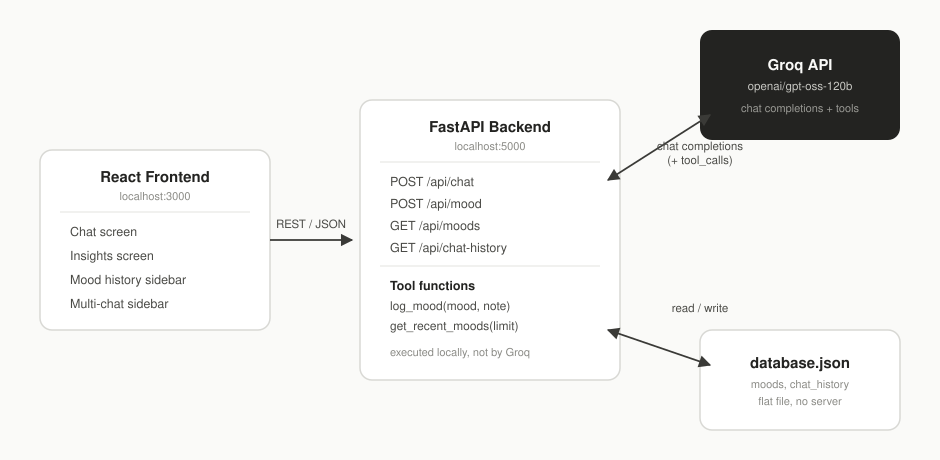

# Senti Health

An AI-first mental-wellness companion. The chat with **Senti** is the main experience of the app - mood tracking and history support the conversation instead of competing with it.

## 🎥 DEMO VIDEO
https://github.com/user-attachments/assets/fb4f0bee-6875-4799-86eb-d53b6f590844


<!--
SCREENSHOTS
Add 3-4 screenshots here once you have them, e.g.:


Suggested shots: the main chat screen mid-conversation, the insights screen
with some real mood history, and one showing the AI auto-logging a mood
(chat message + the resulting entry appearing in Insights).
-->

<!--
DEMO VIDEO
Add a link or embed here once recorded, e.g.:
[Watch the demo](./demo.mp4)

Suggested 60-90s structure:
  0:00-0:10  Open the app straight into the chat screen (nothing else visible)
  0:10-0:35  Have a short emotional conversation, showing a reply that
             auto-logs a mood via the log_mood tool (point out you never
             touched a mood button)
  0:35-0:55  Ask "how have I been feeling lately?" - showing the
             get_recent_moods tool answering from real logged data
  0:55-1:15  Open Insights screen, show the mood history/trend that resulted
  1:15-1:30  Quick mention of the tech stack (FastAPI + Groq + React) as
             an outro
-->

## Architecture



The frontend never talks to Groq directly - all model calls happen server-side in FastAPI, and the frontend only ever calls the four `/api/*` routes shown above.

## Features

- **AI chat companion** (`/api/chat`) - the core experience, powered by Groq (`openai/gpt-oss-120b`)
- **Automatic mood logging** - the model calls a real `log_mood` tool mid-conversation when you clearly express how you're feeling, no separate form needed
- **Context-aware answers about your own history** - the model calls `get_recent_moods` to answer questions like "how have I been feeling lately?" using your actual logged data instead of guessing
- **Manual mood check-in and history** - quick-log buttons and a scrollable mood history, for when you'd rather log directly than through conversation
- **Multiple saved conversations** - a ChatGPT-style sidebar for switching between past chat threads

## Tech stack / Requirements

**Backend**
- Python 3.11+
- FastAPI, Uvicorn
- `openai` Python client (used against Groq's OpenAI-compatible endpoint)
- `python-dotenv`
- A free Groq API key ([console.groq.com/keys](https://console.groq.com/keys)) - no credit card required

**Frontend**
- Node.js (LTS) + npm
- React 18, Create React App
- axios, react-router-dom, react-markdown, react-icons, recharts, Tailwind CSS

No local model download, no GPU, and no PyTorch/transformers anywhere in the current setup - all inference happens through Groq's hosted API.

## Setup instructions (Windows)

### Backend

```bash
cd backend
python -m venv venv
venv\Scripts\activate
pip install -r requirements.txt
```

Create a file named `.env` inside `backend/` with:

```
GROQ_API_KEY=your_real_key_here
```

Then start it:

```bash
python app.py
```

You should see `Using Groq API - model: openai/gpt-oss-120b` and Uvicorn confirming it's running on `http://127.0.0.1:5000`.

### Frontend

```bash
cd frontend
npm install
npm start
```

Opens at `http://localhost:3000` and talks to the backend at `localhost:5000`.

## How the AI tool-calling works

The `/api/chat` endpoint uses real function calling against Groq's API (`openai/gpt-oss-120b`), not a scripted keyword match. Two tools are defined and given to the model on every request:

| Tool | When the model calls it | What it actually does |
|---|---|---|
| `log_mood(mood, note)` | The user clearly expresses how they're feeling in conversation | Writes a new entry to `database.json`, same as the manual mood-check form |
| `get_recent_moods(limit)` | The user asks something like "how have I been feeling lately?" | Reads real recent entries from `database.json` so the answer is grounded in actual data, not invented |

The flow per message:

1. The backend sends the user's message + the tool definitions to Groq.
2. If the model decides to call a tool, the backend executes the corresponding Python function itself (Groq never touches the database directly) and sends the result back to Groq in a second request.
3. Groq returns a final natural-language reply, now aware of what the tool actually returned, which is what gets sent back to the frontend as `reply`.

This is the standard local tool-calling pattern (the model decides *if* and *when* to call a tool; the application executes it and reports the result back) rather than a multi-agent framework - there's one model, two possible tools, and at most one extra round trip per message.

## Limitations

Being upfront about what this project does and doesn't do:

- **No cross-message memory beyond mood data.** Each `/api/chat` request only sends the current message plus the system prompt - not prior turns in the conversation. The model can recall your mood history via `get_recent_moods`, but it can't reference something you said two messages ago unless it happened to get logged as a mood. Real multi-turn context (sending recent conversation history with every request) is a natural next improvement.
- **Single JSON file for persistence.** `database.json` has no concurrency protection - fine for a single local user testing the app, not suitable for multiple simultaneous users.
- **No authentication.** Login/register screens exist in the UI but aren't wired to anything real.
- **Not a clinical tool.** Senti is a supportive conversational companion, not a replacement for therapy or crisis support.
- **Tool-calling reliability depends on the model.** `openai/gpt-oss-120b` supports function calling well, but like any LLM it can occasionally choose not to call a tool when it arguably should (or vice versa) - it's a judgment call the model makes per message, not a guaranteed trigger.

## Performance / Latency

<!--
Run measure_latency.py against your own running backend and paste the
output here. I can't produce real numbers myself since I don't have
network access to Groq's API from this environment - these need to come
from an actual run against your account.

Example of what to paste:

Requests measured : 5
Min               : 0.61s
Max               : 2.14s
Mean              : 1.05s
Median             : 0.88s

Note that any message triggering a tool call (log_mood / get_recent_moods)
involves two round trips to Groq instead of one, so expect those to run
noticeably slower than plain conversational replies.
-->

*(Run `measure_latency.py` and paste your real results here.)*
